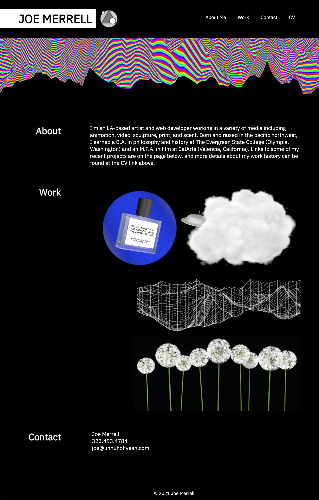

  <h2 align="center">Joe Merrell Portfolio (V1)</h2>

  

    This is the final draft (of the first version) of my portfolio
    
  

## About

 This is a revised version of the original portfolio assignment. I'm responsible for all of the content, including images, HTML and custom CSS. The page was revised in response to suggestions for improvement made by one of the coding bootcamp's excellent TAs. Revisions include:

  - The addition of an avatar to the top of the page. Adding a pic of myself to my portfolio doesn't thrill me, so I used a symbol instead for the time being (and added css animation to make it spin on the Y axis)
  - The addition of a README page (sorry, forgot in original submission)
  - The addition of names/text descriptions to each of the linked projects (revealed on rollover, text itself links)
  - More responsive layout for different screen sizes
  - Adjusted the onscreen navigation for the three sections of the page
  - Made the first "Work" image bigger (actually a combo of two images) to highlight the project

 As we move forward with the program, I plan to post a revamped version of the portfolio that will include:

- More content actually created in the course
- Revised graphics that reflect the new content
- cleaner, grid-based presentation

